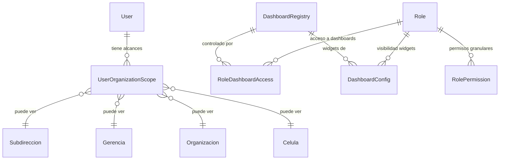

# 9 Dashboards Dinámicos + Modelo de Permisos Granulares (3 Niveles)

## Confirmación de Revisión de Imágenes

He revisado las 9 imágenes de la carpeta `Dashboards - Templates/` y confirmo que entiendo su naturaleza **dinámica e interactiva**, no son mockups estáticos. Cada imagen representa un estado posible de una pantalla viva:

| # | Imagen | Layout Entendido | Dinamismo Clave |
|---|--------|-------------------|-----------------|
| 1 | Dashboard General | 5 tarjetas KPI clickeables + gráfica tendencia + semáforo SLAs + tabla auditorías | Filtros globales, KPIs en tiempo real, navegación por click a cada dashboard |
| 2 | Dashboard Equipo | 4 KPIs + tabla analistas ordenable + panel lateral por analista | Filtro mes, sort columnas, panel lateral historial (sin velocímetro "Salud del Equipo") |
| 3 | Dashboard Programas Anuales | 5 tarjetas programa con velocímetro + histórico cuadritos color + barras comparativas | Click tarjeta → panel lateral con actividades, peso, estatus, historial avance |
| 4 | Dashboard Vulns Desarrollo | 4 niveles drill-down secuenciales (Global→Subdirección→Célula→Repositorio) | Navegación secuencial, NO 4 paneles simultáneos |
| 5 | Dashboard Concentrado Vulns | Dimensión por Motor (6 tarjetas) + Dimensión por Severidad (4 recuadros) | Vista Agrupada/Plana toggle, barra filtros completa, expansión por click |
| 6 | Dashboard Operación | 2 pestañas (Liberaciones + Terceros) + tabla filtrable + panel lateral detalle | Filtros múltiples, panel lateral con flujo estatus y participantes |
| 7 | Kanban Liberaciones | 8 columnas arrastrable + filtros + toggle Kanban/Tabla | Drag & drop, filtros criticidad/responsable/tipo |
| 8 | Dashboard Iniciativas | Tabla filtrable + barras progreso semáforo + panel lateral | Ponderación mensual, historial avance, "Ver plan de trabajo" |
| 9 | Dashboard Temas Emergentes | Tabla filtrable + "Días abierto" con color dinámico + panel lateral con bitácora timeline | Filtro "Sin movimiento en X días", bitácora estilo chat |

---

## Modelo de Permisos Granulares — Diseño de Base de Datos

### Situación Actual

El proyecto ya tiene:
- **`users.role`**: campo string (`admin`, `user`, `super_admin`, `chief_appsec`, `lider_programa`, `analista`, `auditor`, `readonly`)
- **`roles` + `permissions` + `role_permissions`**: catálogo M:N con ~50 códigos de permiso
- **`dashboard_configs`**: tabla existente que mapea `(dashboard_id, widget_id, role_id) → visible`
- **`require_role()`** y **`require_permission()`**: dependencias en `deps.py`
- **Jerarquía org**: `Subdireccion → Gerencia → Organizacion → Celula → (Repositorio|Servicio|ActivoWeb|AplicacionMovil)`

**Lo que falta**: vincular usuarios a su contexto organizacional (Nivel 3) y hacer que los dashboards filtren datos automáticamente según ese contexto.

### Diseño Propuesto — 3 Niveles Simultáneos



---

### Nivel 1 — Acceso a Dashboard Completo

> **Pregunta**: ¿Qué roles pueden ver qué pantalla?

#### [NEW] Tabla `dashboard_registry`

Catálogo de los 9 dashboards con su identificador y metadata:

```python
class DashboardRegistry(Base):
    __tablename__ = "dashboard_registry"
    
    id: UUID (PK)
    code: str(64)          # "general", "equipo", "programas", etc.
    nombre: str(255)       # "Dashboard General Ejecutivo"
    descripcion: str|None
    orden: int             # orden de aparición en sidebar
    icono: str(64)|None    # nombre del icono Lucide
    ruta_frontend: str(255) # "/dashboard/general"
    activo: bool = True
```

#### [NEW] Tabla `role_dashboard_access`

M:N que controla qué roles ven qué dashboard:

```python
class RoleDashboardAccess(Base):
    __tablename__ = "role_dashboard_access"
    
    id: UUID (PK)
    role_id: UUID → FK(roles.id)
    dashboard_id: UUID → FK(dashboard_registry.id)
    puede_ver: bool = True
    puede_exportar: bool = False
```

**Ejemplo de seed**:

| Rol | General | Equipo | Programas | Vulns Dev | Concentrado | Operación | Kanban | Iniciativas | Temas |
|-----|---------|--------|-----------|-----------|-------------|-----------|--------|-------------|-------|
| super_admin | ✅ | ✅ | ✅ | ✅ | ✅ | ✅ | ✅ | ✅ | ✅ |
| chief_appsec | ✅ | ✅ | ✅ | ✅ | ✅ | ✅ | ✅ | ✅ | ✅ |
| lider_programa | ❌ | ✅ | ✅ | ✅ | ✅ | ✅ | ✅ | ✅ | ✅ |
| analista | ❌ | ✅* | ❌ | ✅ | ✅ | ✅ | ✅ | ❌ | ✅ |
| auditor | ✅ | ❌ | ✅ | ✅ | ✅ | ✅ | ❌ | ✅ | ❌ |
| readonly | ✅ | ❌ | ✅ | ✅ | ✅ | ❌ | ❌ | ❌ | ❌ |

> **\*** Analista ve Dashboard Equipo pero Nivel 2 restringe a solo su propio panel

---

### Nivel 2 — Visibilidad por Widget/Sección

> **Pregunta**: ¿Qué secciones dentro de un dashboard puede ver un rol?

#### [MODIFY] Tabla `dashboard_configs` (ya existe)

La tabla existente `dashboard_configs` ya tiene la estructura correcta:

```
dashboard_configs
├── dashboard_id: str  →  código del dashboard ("equipo", "general")
├── widget_id: str     →  sección específica ("kpi_panel", "analista_tabla", "sla_semaforo")  
├── role_id: UUID      →  rol
├── visible: bool      →  ¿puede ver esta sección?
└── editable_by_role: bool  →  ¿puede interactuar/editar?
```

**Ejemplo para Dashboard Equipo**:

| widget_id | Rol analista | Rol lider_programa | Rol chief_appsec |
|-----------|-------------|-------------------|-----------------|
| `equipo.kpi_panel` | ❌ | ✅ | ✅ |
| `equipo.tabla_analistas` | solo_propio* | ✅ | ✅ |
| `equipo.panel_lateral_detalle` | solo_propio* | ✅ | ✅ |
| `equipo.historial_avance_global` | ❌ | ✅ | ✅ |

> \* "solo_propio" se implementa como `visible=true` + filtro de Nivel 3 (contexto)

---

### Nivel 3 — Filtrado por Contexto Organizacional

> **Pregunta**: ¿Qué datos puede ver un usuario según su posición en la jerarquía?

#### [NEW] Tabla `user_organization_scope`

Vincula cada usuario con los nodos organizacionales que puede ver. Un usuario puede tener **múltiples** scopes (ej: responsable de 2 células):

```python
class UserOrganizationScope(Base):
    __tablename__ = "user_organization_scopes"
    
    id: UUID (PK)
    user_id: UUID → FK(users.id)
    
    # Exactamente uno de estos 4 debe estar poblado (el más específico gana):
    subdireccion_id: UUID|None → FK(subdireccions.id)
    gerencia_id: UUID|None → FK(gerencias.id)
    organizacion_id: UUID|None → FK(organizacions.id)
    celula_id: UUID|None → FK(celulas.id)
    
    # Nivel del scope para facilitar queries
    scope_level: str(32)  # "subdireccion" | "gerencia" | "organizacion" | "celula"
    
    # Auditoría
    created_at: datetime
    created_by: UUID|None → FK(users.id)
```

**Lógica de resolución del scope**:

```
1. super_admin / chief_appsec  →  Sin filtro, ven TODO
2. Usuario con scope_level="subdireccion" → Ve todos los datos bajo esa subdirección
3. Usuario con scope_level="celula"       → Solo ve datos de esa célula
4. Usuario sin scope asignado             → Solo ve datos creados por él (user_id = current_user.id)
```

#### [NEW] Dependencia `resolve_data_scope()`

```python
async def resolve_data_scope(
    current_user: User,
    db: AsyncSession,
) -> DataScope:
    """Resuelve las células visibles para el usuario actual.
    
    Returns:
        DataScope con:
        - is_global: bool (sin restricción)
        - celula_ids: set[UUID] (células permitidas)
        - user_only: bool (solo sus propios registros)
    """
    # super_admin / chief_appsec → global
    if current_user.role in ("super_admin", "chief_appsec", "admin"):
        return DataScope(is_global=True)
    
    # Buscar scopes del usuario
    scopes = await get_user_scopes(db, current_user.id)
    
    if not scopes:
        return DataScope(user_only=True)
    
    # Resolver todas las células bajo cada scope
    celula_ids = set()
    for scope in scopes:
        celula_ids |= await resolve_celulas_from_scope(db, scope)
    
    return DataScope(celula_ids=celula_ids)
```

---

## User Review Required

> [!IMPORTANT]
> **Matriz de acceso por dashboard**: La tabla de Nivel 1 que propongo arriba es un punto de partida. Necesito que confirmes qué roles exactos tienen acceso a cada uno de los 9 dashboards, ya que esto determina el seed inicial.

> [!IMPORTANT]
> **Regla "solo_propio" en Dashboard Equipo**: ¿El analista debe poder ver SOLO su fila en la tabla de analistas, o puede ver las filas de otros analistas de su misma célula pero sin poder ver su panel lateral de detalle?

> [!WARNING]
> **Notas sobre el Dashboard Operación (imagen 6)**: La imagen de referencia usa un estilo visual diferente (fondo blanco, estilo AppSecOps) vs. las demás (fondo oscuro, estilo APPSEC COMMAND CENTER). ¿Debo unificar al estilo oscuro de las otras 8 imágenes, o este dashboard tiene intencionalmente un tema diferente?

> [!WARNING]
> **Velocímetro "Salud del Equipo" (Dashboard 2)**: Confirmo que lo eliminaré por tu instrucción explícita. Sin embargo, la imagen muestra un gauge de 72% con "En Riesgo" en la esquina inferior izquierda. ¿Quieres que ese espacio se reutilice para otro widget o simplemente se elimine?

## Open Questions

1. **Roles adicionales**: ¿Hay roles del negocio que no están en `RolEnum` y necesitan crearse? Por ejemplo: `responsable_celula`, `director_subdireccion`, `lider_liberaciones`.

2. **Herencia de scope**: Si un `lider_programa` tiene scope a nivel `gerencia`, ¿debería ver automáticamente todas las organizaciones y células bajo esa gerencia? (Propongo que sí, cascada hacia abajo).

3. **Dashboard Vulns Desarrollo — Nivel 3 (Repositorio)**: Las pestañas mostradas son "Vulnerabilidades activas / Historial / Dependencias / Configuración". ¿Las pestañas "Dependencias" y "Configuración" son funcionalidad real que debo implementar, o son placeholder visual?

4. **Admin de permisos**: ¿El panel de administración existente (`/admin/roles`) debe extenderse para gestionar los 3 niveles (asignar dashboards a roles, configurar widgets por rol, y asignar scopes a usuarios)?

5. **Kanban de Liberaciones**: ¿Las 8 columnas del flujo son fijas o configurables? Veo: Recibida → Revisión de Diseño → Validaciones de Seguridad → Con Observaciones → Pruebas de Seguridad → VoBo Dado → En QA → En Producción.

---

## Proposed Changes

### Componente 1: Modelo de Datos — Permisos Granulares

#### [NEW] `backend/app/models/user_organization_scope.py`
Nuevo modelo `UserOrganizationScope` con FKs opcionales a los 4 niveles de la jerarquía org.

#### [NEW] `backend/app/models/dashboard_registry.py`
Catálogo de los 9 dashboards con metadata (code, nombre, ruta, icono, orden).

#### [NEW] `backend/app/models/role_dashboard_access.py`
Tabla M:N `role_dashboard_access` que controla Nivel 1 (acceso al dashboard completo por rol).

#### [MODIFY] [dashboard_config.py](file:///Users/pablosalas/Appsec/appsec-platform/backend/app/models/dashboard_config.py)
Agregar FK a `dashboard_registry` para vincular `dashboard_id` al catálogo formal.

#### [NEW] `backend/alembic/versions/xxx_add_granular_permissions.py`
Migración que crea las 3 nuevas tablas y modifica `dashboard_configs`.

---

### Componente 2: Core — Resolución de Scope

#### [NEW] `backend/app/core/data_scope.py`
Dataclass `DataScope` y función `resolve_data_scope()` que resuelve las células visibles del usuario actual.

#### [MODIFY] [deps.py](file:///Users/pablosalas/Appsec/appsec-platform/backend/app/api/deps.py)
- Agregar dependencia `require_dashboard_access(dashboard_code)` → verifica Nivel 1
- Agregar dependencia `get_data_scope()` → inyecta `DataScope` en los endpoints
- Agregar dependencia `require_widget_visible(dashboard_code, widget_id)` → verifica Nivel 2

#### [MODIFY] [permissions.py](file:///Users/pablosalas/Appsec/appsec-platform/backend/app/core/permissions.py)
Agregar códigos de permiso por dashboard específico (`dashboards.general.view`, `dashboards.equipo.view`, etc.).

---

### Componente 3: Seeds de Permisos

#### [MODIFY] [permission_seed.py](file:///Users/pablosalas/Appsec/appsec-platform/backend/app/services/permission_seed.py)
Extender el seed para poblar `dashboard_registry` (9 dashboards), `role_dashboard_access` (matriz rol×dashboard), y `dashboard_configs` (widgets por rol).

---

### Componente 4: Backend — Endpoints de Dashboard

#### [MODIFY] [dashboard.py](file:///Users/pablosalas/Appsec/appsec-platform/backend/app/api/v1/dashboard.py)
Refactorizar los endpoints existentes para:
1. Inyectar `DataScope` y filtrar automáticamente por contexto org del usuario
2. Usar `require_dashboard_access("general")` en vez de `require_permission(P.DASHBOARDS.VIEW)` genérico
3. Agregar nuevos endpoints faltantes:
   - `GET /dashboard/executive-kpis` — KPIs del Dashboard General
   - `GET /dashboard/programs-annual` — Programas Anuales con velocímetros
   - `GET /dashboard/vuln-drilldown/{level}` — Drill-down por nivel (0-3)
   - `GET /dashboard/vuln-concentrated` — Concentrado por Motor + Severidad
   - `GET /dashboard/operations` — Liberaciones + Terceros
   - `GET /dashboard/sidebar-menu` — Lista de dashboards accesibles para el usuario actual

#### [NEW] `backend/app/api/v1/admin/dashboard_permissions.py`
Endpoints admin para gestionar los 3 niveles:
- CRUD de `role_dashboard_access` 
- CRUD de `dashboard_configs` (widgets)
- CRUD de `user_organization_scopes`

---

### Componente 5: Frontend — 9 Páginas de Dashboard

> [!NOTE]
> Cada página se implementará fiel al layout de la imagen de referencia, con la paleta de colores dark (fondo `#0a0e1a`, acentos semáforo verde/amarillo/naranja/rojo), y toda la interactividad especificada.

#### [NEW] `frontend/src/app/(dashboard)/dashboards/general/page.tsx`
#### [NEW] `frontend/src/app/(dashboard)/dashboards/equipo/page.tsx`
#### [NEW] `frontend/src/app/(dashboard)/dashboards/programas/page.tsx`
#### [NEW] `frontend/src/app/(dashboard)/dashboards/vulnerabilidades/page.tsx`
#### [NEW] `frontend/src/app/(dashboard)/dashboards/concentrado/page.tsx`
#### [NEW] `frontend/src/app/(dashboard)/dashboards/operacion/page.tsx`
#### [NEW] `frontend/src/app/(dashboard)/dashboards/kanban/page.tsx`
#### [NEW] `frontend/src/app/(dashboard)/dashboards/iniciativas/page.tsx`
#### [NEW] `frontend/src/app/(dashboard)/dashboards/temas-emergentes/page.tsx`

### Componente 6: Frontend — Componentes Compartidos

#### [NEW] `frontend/src/components/dashboards/KpiCard.tsx`
#### [NEW] `frontend/src/components/dashboards/SemaforoSla.tsx`
#### [NEW] `frontend/src/components/dashboards/GaugeChart.tsx`
#### [NEW] `frontend/src/components/dashboards/DrilldownBreadcrumb.tsx`
#### [NEW] `frontend/src/components/dashboards/SidePanel.tsx`
#### [NEW] `frontend/src/components/dashboards/FilterBar.tsx`
#### [NEW] `frontend/src/components/dashboards/HistoricoMensual.tsx`

---

## Verification Plan

### Automated Tests

```bash
# 1. Test de Nivel 1 — Acceso a Dashboard
make test  # Extiende test_contract.py para verificar que cada endpoint
           # de dashboard tiene require_dashboard_access

# 2. Test de Nivel 2 — Visibilidad de Widgets
# Nuevo test: test_dashboard_permissions.py
# - Verifica que un analista no ve el kpi_panel del Dashboard Equipo
# - Verifica que chief_appsec ve todos los widgets

# 3. Test de Nivel 3 — Filtrado por Contexto Org
# Nuevo test: test_data_scope.py
# - Crea 2 células con vulnerabilidades
# - Asigna scope de célula A al usuario X
# - Verifica que usuario X solo ve vulns de célula A

# 4. Migración
docker compose exec backend alembic upgrade head
docker compose exec backend alembic check  # no pending
```

### Manual Verification
- Validación visual de cada dashboard contra su imagen de referencia en el browser
- Testing de interactividad (drill-down, paneles laterales, filtros, sort, drag & drop)
- Testing de permisos con diferentes usuarios/roles
